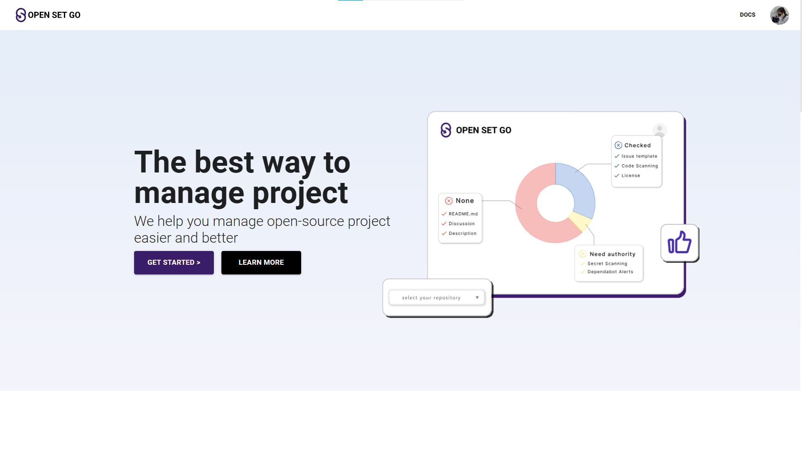
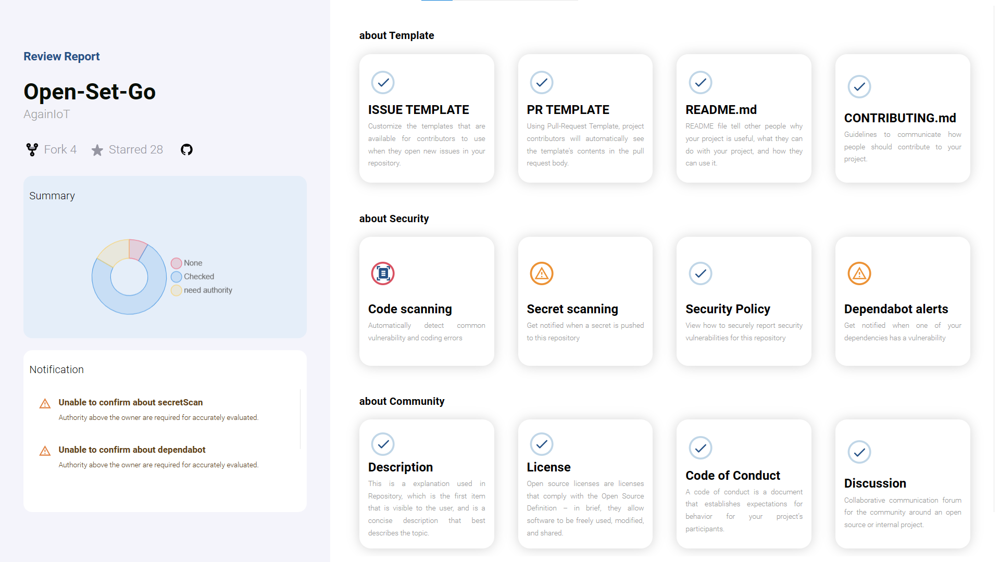
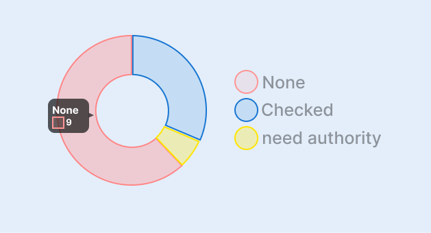
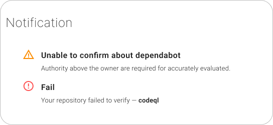
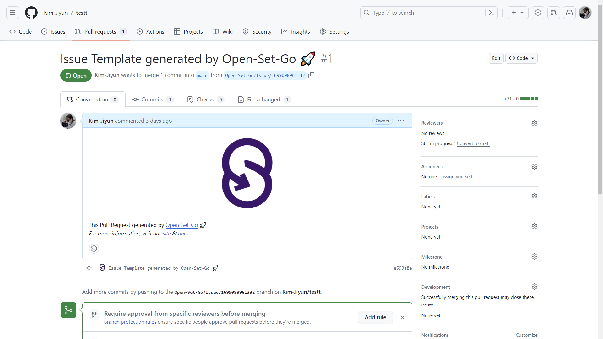

## Introduction

'The Open-Source Management Platform' for Open-Source Developers that provides the creation of new open-source projects and operational review for existing projects.

## Functionalities

### 1. Create Repository

 **Repository**

Create repository and create .gitignore file with language, framework, and os information.

 **License**

Select a license suitable for your project by looking at the names, descriptions, and information of the licenses.

 **Pull-Request Template**

Various PR template presets can be selected or customized to apply.

 **Issue Template**

Issue template presets can be provided to select and apply appropriate ones for each purpose.

 **CONTRIBUTING.md**

Users can select from multiple presets what they want to write in their projects, modify them to fit their projects, and apply them.

 **README.md**

Select and insert a preset for each content, and you can write the details according to your project by referring to the preset.

### 2. Review

There is a review function to evaluate whether an already created repository is suitable for an open-source project. Evaluate the 12 capabilities provided by the hub to build an open-source project environment in three categories. This evaluation of operations understands and enables these 12 factors to effectively run open-source projects.

**Summary** 

The Summary provides a brief summary of the results of the operational evaluation. You can select only the items you want and check them with a graph, or you can check the quantity of each item.

Does not exist or is not active

Exists and Active

Owner or more privileges required

**Notification** 
Notification provides a description of 'need authority' and 'None'. Provides a brief description of when an item does not have access or fails.

**Add Template** 
When the user modifies the template and clicks the Complete button, a pull-request is created for the selected repository. You can add an Issue Template, Pull-Request Template, README.md , and Contributing.md the same as you did with the Create Repository.

## Website

[<li> GitHub](https://github.com/AgainIoT/Open-Set-Go)
[<li> Website]("https://www.open-set-go.com/")
